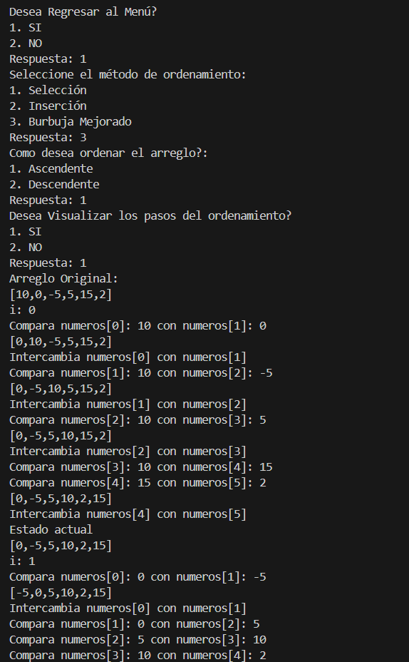
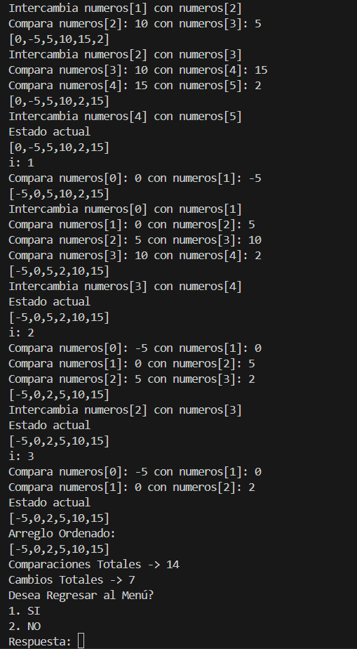
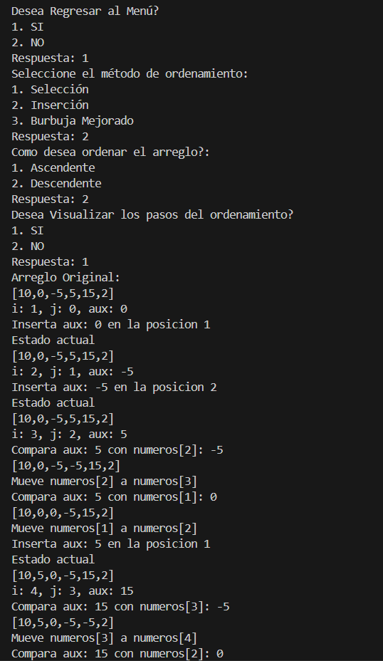
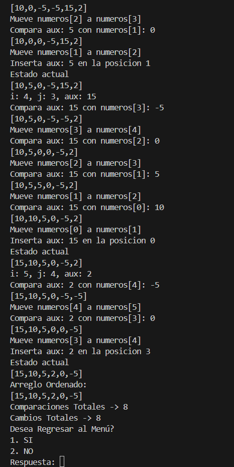
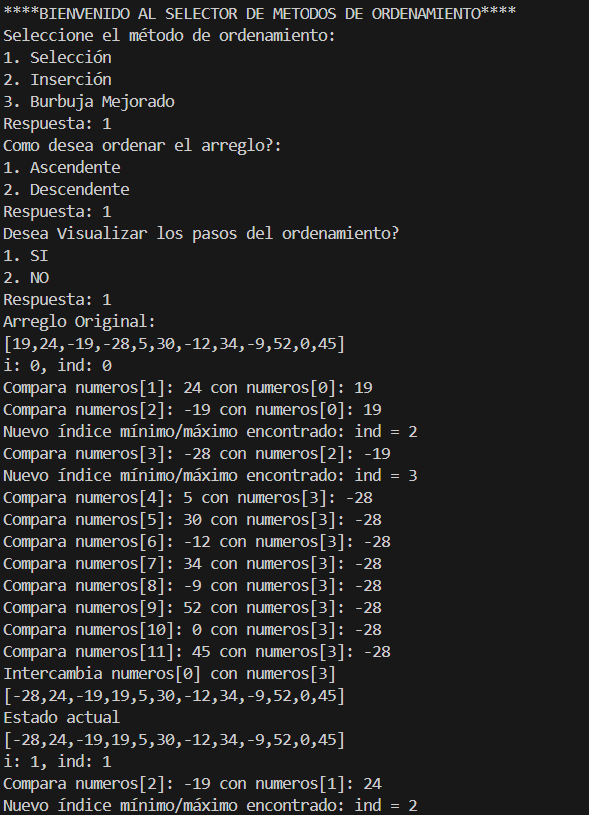
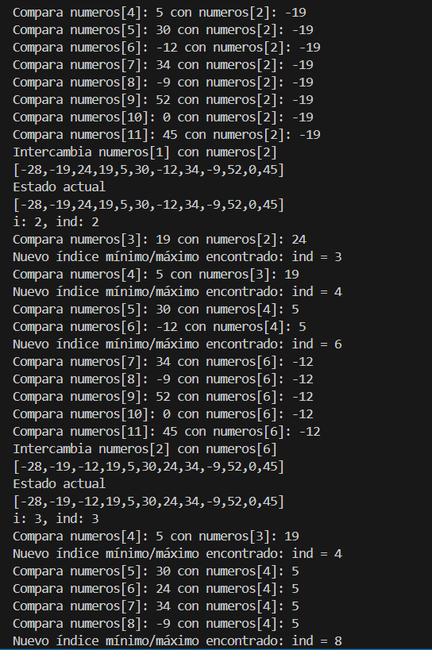
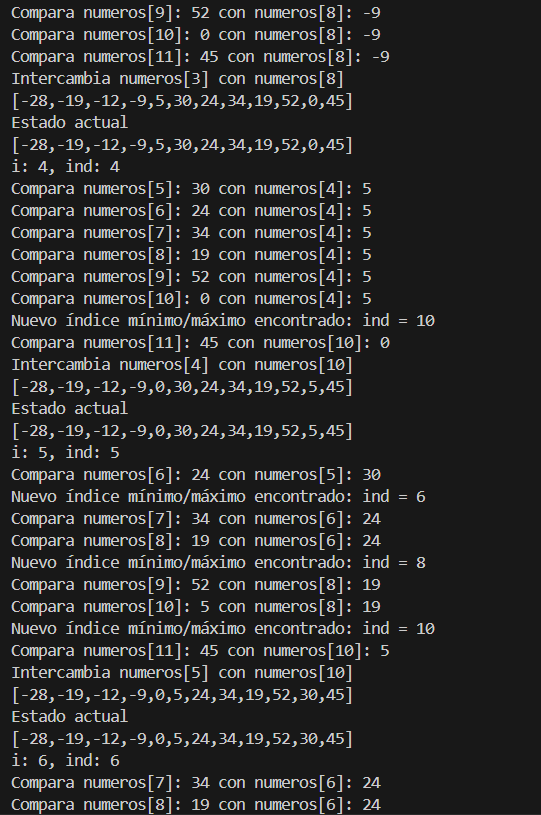
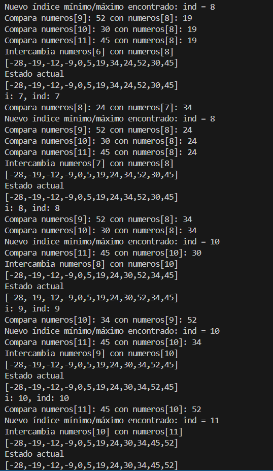
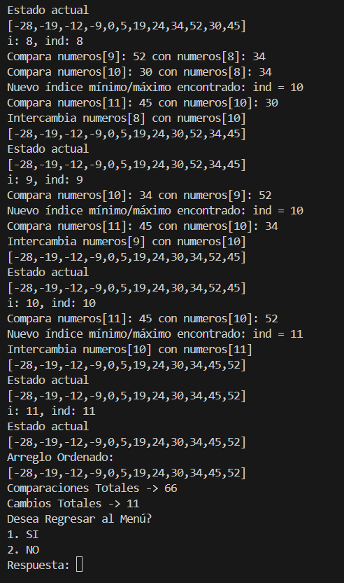

# Estructura de Datos

**Estudiante:** Nicolas Cornejo

## Practica de Laboratorio 1

### Algoritmos de Ordenamiento - 30/OCT

- Clase View

- Metodo Sort Bubble:
Recorre el arreglo comparando pares de elementos adyacentes y los intercambia si están fuera de orden. Su característica principal es que en cada iteración el elemento más grande (o pequeño) se desplaza hacia el final del arreglo, como una “burbuja” que asciende.

- Metodo Sort Insertion:
Toma cada elemento y lo inserta en la posición correcta dentro de la porción ya ordenada del arreglo.
Es más eficiente que el burbuja en arreglos parcialmente ordenados, ya que reduce el número de intercambios.

- Metodo Sort Selection:
Busca el valor mínimo (o máximo) en cada pasada y lo coloca en su posición definitiva.
Reduce el número de intercambios respecto al burbuja, aunque mantiene un número de comparaciones alto.

Salida Bubble

Salida Insertion

Salida Selection

### Resultados obtenidos:

    - Burbuja: 14 comparaciones y 7 cambios

    - Inserción: 8 comparaciones y 8 cambios  

    - Selección: 66 comparaciones	y 11 cambios

### Conclusiones

El algoritmo de Inserción se mostró como el más eficiente en términos de comparaciones y cambios, siendo recomendable para arreglos de tamaño medio o parcialmente ordenados.

El algoritmo de Burbuja, aunque menos eficiente, es el más intuitivo y didáctico para entender los procesos de intercambio en ordenamiento.

El algoritmo de Selección realiza un número fijo y elevado de comparaciones, por lo que no resulta ideal en términos de rendimiento, aunque su implementación es simple.